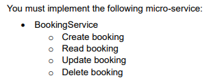

# **TSC Hotel Room Booking Website**

- This repository provides the code for the implementation of the BookingService microservice, which is part of the TSC Hotel & Tourism project. CRUD (Create, Read, Update, Delete) actions for TSC hotel room bookings are managed by this BookingService.

## **BookingService Microservice**
### _Task Requirement for the Assessment 2_  
  

## **Functionalities for the TSC Hotel Room Booking Website :**
- Login using email address and password
- View Account details of the user.
- View the List of Rooms.
- Create a booking.
- View bookings.
- Edit booking.
- Delete booking.
---

## **Technologies Used**  
- Development Environment Used: Visual Studio Code
  
- Code Pattern Used: MVC (Model-View-Controller)
  - Model: Responsible for data and database logic.
  - View: Developed with EJS templates and front-end styled with CSS.
  - Controller: JavaScript files serve as the controller for handling APIs and database interaction.
- Languages Used:
  - Node.js (JavaScript): For back-end programming.
  - EJS: Used to render dynamic HTML pages.
  - CSS: Used to style the user interface.
